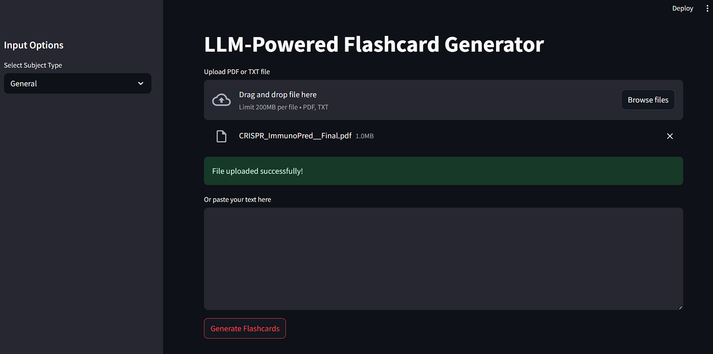
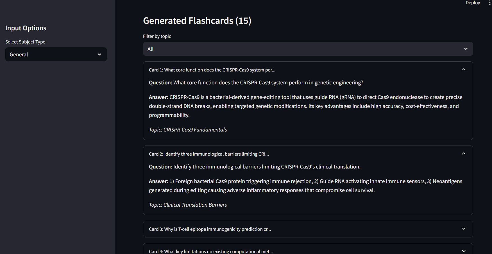

# Flashcard Generator Repository Documentation

\$1

## Demo




---

## Installation Guide

### Prerequisites

* **Python** 3.8 or higher
* **Hugging Face API token**
* **pip** or **conda**

### Required Packages

* `streamlit`
* `PyPDF2`
* `requests`
* `python-dotenv`

---

## Setup Instructions

1. **Clone the Repository**

   ```bash
   git clone https://github.com/your-username/flashcard_generator.git
   cd flashcard_generator
   ```

2. **Install Dependencies**

   ```bash
   pip install -r requirements.txt
   ```

3. **Create Environment File**

   ```bash
   touch .env
   ```

   Add your Hugging Face token:

   ```env
   HF_TOKEN=your_huggingface_read_token
   ```

4. **Run the Application**

   ```bash
   streamlit run app.py
   ```

   Access the interface at `http://localhost:8501`.

---

## Usage

### Core Features

1. **Input Options**

   * Upload **PDF** or **TXT** files
   * Paste text manually
   * Select subject type (e.g., General, Biology, Computer Science, History, Math)

2. **Flashcard Generation**

   * Click **Generate Flashcards** to create 15 cards with:

     * **Topic categorization**
     * **Diverse question types** (definitions, comparisons, scenarios)
     * **Detailed answers** with contextual explanations

3. **Interactive Interface**

   * **Filter** flashcards by detected topics
   * **Export** options:

     * **CSV** (for Anki integration)
     * **JSON** (for programmatic use)

4. **Quality Assurance**

   * Duplicate prevention
   * Error handling for API failures
   * Misconception flagging in answers

---

## Key Components

### Architecture

```
flashcard_generator/
├── app.py                  # Streamlit frontend interface
├── flashcard_generator.py  # API integration & flashcard logic
├── utils.py                # Text extraction & topic detection
├── .env                    # Hugging Face token configuration
└── requirements.txt        # Dependency list
```

### Data Flow

1. **Text Extraction**

   * **PDF** → PyPDF2 → raw text
   * **TXT** → direct read
2. **Topic Detection**

   * Heuristic analysis of subheadings
   * Maximum 5 topics identified
3. **Flashcard Generation**

   * Prompt engineering with structured output
   * Fireworks AI API (DeepSeek-R1 model)
4. **Response Parsing**

   * Delimiter-based extraction (`Q:/`, `A:/`, `TOPIC:`)
   * Topic mapping to cards

### API Integration

**Fireworks AI Configuration**

```python
API_URL = "https://router.huggingface.co/fireworks-ai/inference/v1/chat/completions"
MODEL = "accounts/fireworks/models/deepseek-r1-0528"
HEADERS = {"Authorization": f"Bearer {HF_TOKEN}"}
```

---

## Approach Summary

### 1. Prompt Engineering

* Crafted a detailed instruction template to:

  * Ensure structured output format
  * Promote diverse question types
  * Maintain educational quality
  * Enforce content coverage guidelines

### 2. Topic Detection

* Uses simple but effective pattern recognition:

  * Lines ending with colon (`:`)
  * Capitalized headers
  * Limited to first 5 topics

### 3. Error Handling

* Graceful degradation for empty inputs
* API response validation
* Robust text truncation (4096 chars limit)

### 4. User Experience

* Interactive filtering
* Clean card display
* Multiple export formats

---

## Deployment

### Local Development

```bash
streamlit run app.py
```

### Production Options

* **Streamlit Cloud**: Native deployment support
* **Hugging Face Spaces**: Git integration for quick setup
* **Docker**: Containerization recommended for API stability

```dockerfile
FROM python:3.8-slim
WORKDIR /app
COPY . .
RUN pip install -r requirements.txt
CMD ["streamlit", "run", "app.py", "--server.port", "8501", "--server.address", "0.0.0.0"]
```

---

## Configuration

### `.env` File

```env
HF_TOKEN=your_huggingface_api_key
```

### Flashcard Parameters

* **Card Count**: 15 flashcards per generation
* **Max Tokens**: 2048 for comprehensive responses
* **Temperature**: 0.3 for deterministic output
* **Text Truncation**: First 4096 characters prioritized

---

## Additional Resources

* [Fireworks API Docs](https://huggingface.co/docs/api-inference)
* [Streamlit Documentation](https://docs.streamlit.io)
* [PyPDF2 Documentation](https://pypdf2.readthedocs.io)

---

## Improvements & Extensions

1. **Enhanced Parsing**

   * Add regex validation for flashcard format
   * Implement JSON schema validation
2. **Advanced Topics**

   * NLP-based topic modeling (e.g., BERTopic)
   * Hierarchical topic clustering
3. **Export Enhancements**

   * AnkiConnect integration
   * Quizlet API export
4. **Performance Optimization**

   * Caching for repeated content
   * Batch processing mode

---

## Contributing

1. Fork the repository
2. Create a feature branch (`git checkout -b feature/YourFeature`)
3. Commit your changes (`git commit -m "Add YourFeature"`)
4. Push to the branch (`git push origin feature/YourFeature`)
5. Open a Pull Request - report bugs via GitHub Issues

---

## License

This project is licensed under the MIT License. See the [LICENSE](LICENSE) file for details.

---

This system provides an effective bridge between raw educational content and structured study materials, leveraging state-of-the-art LLM capabilities through a user-friendly interface.
